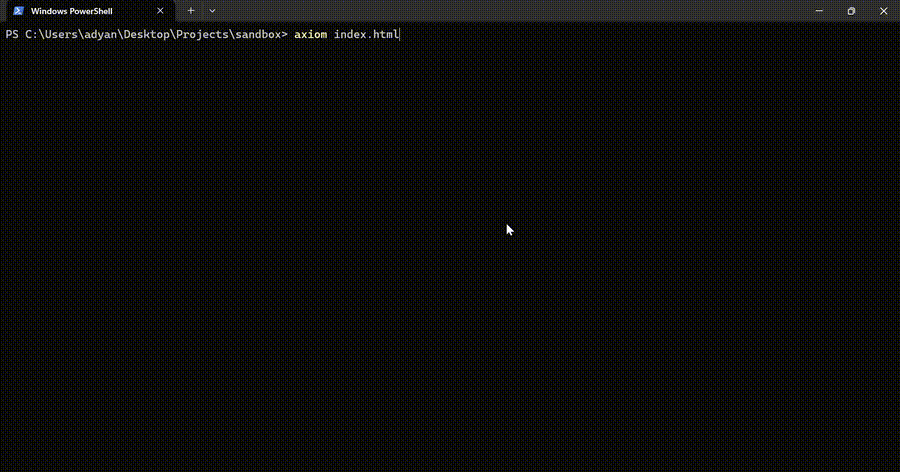

# Axiom TUI

A terminal text editor that doesn't make you feel lame.



I have an ubuntu server on my rpi5 running in my room and I kept needing to edit files on it. Nano works but it looks like it's from the 90s. I tried vim but it wasn't satisfactory using it, So I thought why not make an usable, modern tui text editor for fun? I was out of ideas and I had a weekend to spare. So I built this.

It's not trying to replace anything. It's just a small editor you can open from the terminal when you need to make a quick edit and you want it to not look terrible.

## Install

You need Python 3.11+

**Recommended** - install from PyPI:

```bash
pip install axiom-tui
```

That's it. Now you can open files from anywhere:

```bash
axiom main.py
axiom ~/.bashrc
axiom /etc/nginx/nginx.conf
```

**Want to build it yourself?** Clone and install in editable mode:

```bash
git clone https://github.com/adyanthm/axiom-tui.git
cd axiom-tui
pip install -e .
```

This way you get the `axiom` command and any changes you make to the source take effect immediately.

## Don't have Python?

Grab `axiom.exe` (or the Linux/Mac binary) from the [releases](https://github.com/adyanthm/axiom-tui/releases) page. No Python needed, everything is bundled inside.

To use it as a global command (so you can just type `axiom file.py` from anywhere):

**Windows:**
1. Download `axiom.exe`
2. Put it somewhere like `C:\tools\`
3. Add that folder to your PATH (search "environment variables" in Start, edit the `Path` variable, add `C:\tools\`)
4. Open a new terminal and you're good to go

**Linux:**
```bash
chmod +x axiom-linux
sudo mv axiom-linux /usr/local/bin/axiom
```

**Mac:**
```bash
chmod +x axiom-macos
sudo mv axiom-macos /usr/local/bin/axiom
```

After that, just use it like any other command:
```bash
axiom server.py
axiom ~/.bashrc
axiom config.yml
```

## What it does

- **Syntax highlighting** for Python, JS, TS, Rust, Go, C, Java, Ruby, and a bunch more.
- **Autocomplete (LSP)** for an IDE-like experience right in the terminal.
- **File tree** on the left so you can browse around without leaving the editor.
- **Search** that actually jumps to the match.
- **Line numbers** and a status bar with cursor position.
- **Unsaved changes indicator** (little dot next to the filename).
- **Theme sync** - When you switch app themes the syntax colors follow along. This one took me an embarrassingly long time to figure out because Textual's TextArea has its own theme system completely separate from the app. Fun.

## Keybinds

| Key | Does |
|---|---|
| `ctrl+s` | Save |
| `ctrl+f` | Search (Enter to find, Esc to close) |
| `ctrl+b` | Toggle file tree |
| `ctrl+q` | Quit |

You can also switch themes through Textual's command palette.

## Autocomplete (LSP)

I added Language Server Protocol (LSP) support so you get live, IDE-like autocomplete dropdowns as you type. Navigate with `Up`/`Down` and accept with `Tab`

Because language servers are huge, I didn't bundle them all by default. It's smart enough to just degrade gracefully to a normal editor if you don't have the server installed.

**For Python:**
Just install the editor with the `[lsp]` extra and you're good to go:
```bash
pip install axiom-tui[lsp]
```
*(This just installs `python-lsp-server` alongside the editor).*

**For other languages:**
It works for other languages too, you just need to have their respective language servers installed on your system. Axiom will automatically find them and connect.

*   **JS/TS**: needs `typescript-language-server`
*   **Rust**: needs `rust-analyzer`
*   **Go**: needs `gopls`
*   **C / C++**: needs `clangd`

## The Theme Thing

So here's a fun rabbit hole I fell into: Textual has app themes (like Dracula, Nord, Catppuccin etc) and the TextArea widget has its own completely separate syntax highlighting themes. When you switch the app theme, only the UI chrome changes - the actual code highlighting stays the same.

I fixed this by mapping each app theme to the closest syntax theme. It's not perfect but it works. If you switch to Dracula the syntax goes Dracula, if you pick something light it switches to GitHub Light, etc.

## Stuff I might add

- [ ] Find and replace (right now it's just find)
- [ ] Tabs for multiple files
- [ ] Remember last open file
- [ ] Goto line number

No promises though. This is a weekend project that I use for myself. If it helps you too, cool.

## Contributing

PRs are welcome. Just keep it simple - the whole point is that this is a small, clean codebase. If your feature doubles the line count, maybe it should be a fork instead.

## License

MIT. Do whatever you want with it.
